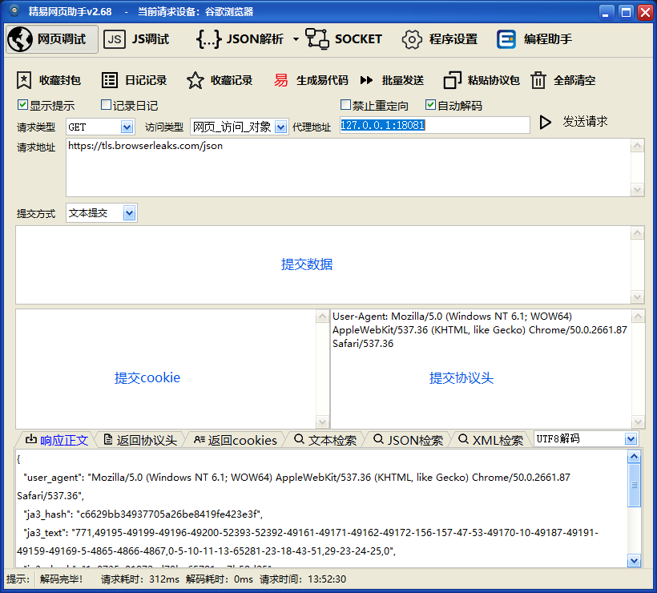

# Proxy JA3

🔐 基于 SunnyNet 实现多语言随机 TLS 指纹代理。

[](https://github.com/jwwsjlm/proxy_ja3/releases)
[](LICENSE)
[](https://golang.org)

---

## ✨ 功能特性

- 🔐 **JA3 指纹** - 随机 TLS 指纹，绕过指纹识别
- 🌐 **多语言支持** - 支持多种开发语言调用
- ⚡ **高性能** - 基于 SunnyNet 核心
- 🛠️ **易集成** - 简单配置即可使用

---

## 🚀 快速开始

### 下载程序

从 [Releases](https://github.com/jwwsjlm/proxy_ja3/releases) 下载最新版本

### 运行

```bash
./main.exe --prot 18080 --proxy
```

**参数说明：**
| 参数 | 说明 | 默认值 |
|------|------|--------|
| `--prot` | 代理端口 | 18080 |
| `--proxy` | 启用代理模式 | 关闭 |

---

## 📖 技术说明

### JA3 指纹

JA3 是一种 TLS 指纹识别技术，通过记录 TLS 握手的特征来识别客户端。

本项目通过随机化 TLS 指纹，实现：
- 绕过基于 JA3 的封锁
- 提高代理的隐蔽性
- 支持多种客户端模拟

### 核心依赖

- [SunnyNet](https://github.com/qtgolang/SunnyNet) - 高性能网络库

---

## 📸 运行截图



---

## 🛠️ 源码编译

```bash
git clone https://github.com/jwwsjlm/proxy_ja3.git
cd proxy_ja3
go build -o main.exe main.go
```

---

## 📄 许可证

MIT License

---

## 📬 联系方式

- GitHub: [@jwwsjlm](https://github.com/jwwsjlm)
- 博客：https://blog.xsojson.com

---

**如果有帮助，欢迎 Star ⭐️！**
